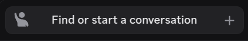

# 

WiemanTheme is a custom theme designed for BetterDiscord.

Initially made for personal use, I decided to make it available to the public for anyone to download if they wish.

## Notable Features

- A custom color scheme that is easy on the eyes, featuring a nice purple color.
- Some readjustment of UI elements to eliminate clutter and make the UI more compact.  
    
- A collapsible server list to make better use of space.  
    

## Installation

If you're interested, you can [download the latest release](https://github.com/wiemanboy/WiemanTheme/releases/).
Alternatively, you can clone this file from the [release branch](https://github.com/wiemanboy/WiemanTheme/tree/release).

```bash
git clone --branch release --single-branch https://github.com/wiemanboy/WiemanTheme.git
```

If you are interested in editing or forking the theme, you can clone
the [master branch](https://github.com/wiemanboy/WiemanTheme/tree/master) and compile the stylesheet yourself.

## Compiling the Stylesheet

To compile the stylesheet, you will need to have [Node.js](https://nodejs.org/en/) installed.

First, install the dependencies:

```bash
npm install
```

Then the scss files can be compiled using the following command:

```bash
npm run compile
```

The info for the theme can be changed in the compile command:

```bash
npm run compile -- name="CustomName" author="you" description="Custom description" source="github link"
```

## Bugs and Suggestions

If you find any bugs or have any suggestions, feel free to open an issue or pull request.
