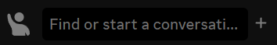
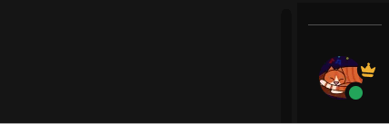

WiemanTheme is a custom theme designed for BetterDiscord.

Initially made for personal use, I decided to make it available to the public for anyone to download if they wish.

## Notable Features

-   A custom color scheme that is easy on the eyes, featuring a nice purple color.
-   Some readjustment of UI elements to eliminate clutter and make the UI more compact.  
    
-   A collapsible server list to make better use of space.  
    

## Installation

If you're interested you can [download the latest release](https://github.com/wiemanboy/WiemanTheme/releases/).
Alternatively, you can clone this file from the [release branch](https://github.com/wiemanboy/WiemanTheme/tree/release).

If you are interested in editing or forking the theme, you can clone
the [master branch](https://github.com/wiemanboy/WiemanTheme/tree/master) and compile the stylesheet yourself by:

Installing the sass dependency:

```bash
npm install
```

And compiling the stylesheet:

```bash
npm run compile
```
